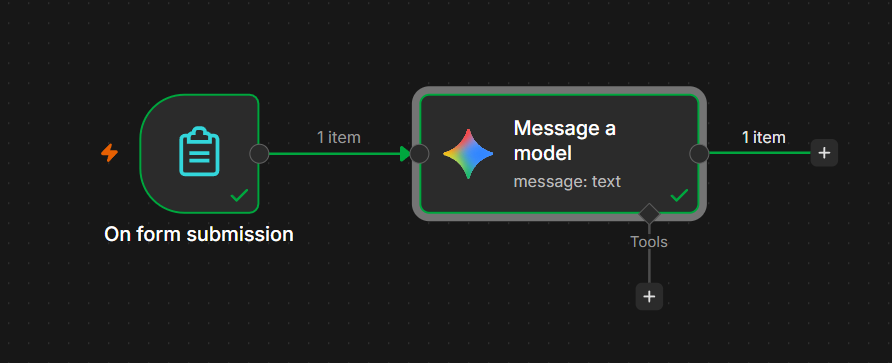

# n8n Workflows

A collection of automation workflows built with n8n and the Gemini API.

## 1. Text Summarizer

A form where you paste text and get back a short summary written by an AI model.

**How it works**

1. An n8n Form Trigger collects the text (and optionally the number of sentences).
2. A Google Gemini node sends the text to the model with a summarizing prompt.
3. The summary is returned as the result.

**How to use it**

1. In n8n, open the menu and choose Import from file, then select `text-summarizer.json`.
2. Open the Gemini node and add your own Gemini API credential (free keys are available from Google AI Studio).
3. Click Execute workflow, fill in the form, and check the output.

**Notes**

- No API keys are stored in this repository. You need your own credentials.
- Model names change often. If the node reports that a model isn't found, pick a current one from the node's dropdown.